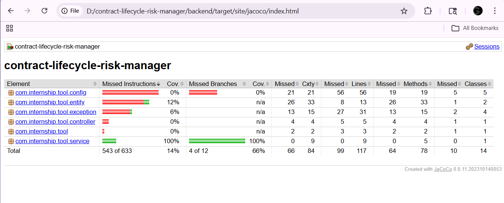

# Contract Lifecycle Risk Manager

## 🛠️ Tech Stack & Architecture

### **Core Backend (Java Developer 1)**
* **Framework**: Spring Boot 3.2.0 (Java 17)
* **Database**: PostgreSQL with **Flyway** for schema versioning.
* **Caching**: **Redis** integration for high-performance contract retrieval.
* **Security**: Stateless **JWT** authentication with Spring Security.
* **API Docs**: Swagger/OpenAPI UI available at `/swagger-ui.html`.

### **AI & Data Layer**
* **AI Microservice**: Python (Flask) handling contract risk summarization.
* **Storage**: Hybrid approach using RDBMS (PostgreSQL) and Cache (Redis).

---

## 📊 Quality Assurance & Testing

To ensure the reliability of the **Contract Lifecycle Risk Manager**, the backend follows a strict testing protocol using **JUnit 5** and **Mockito**.

### **Day 11 Technical Milestone: Sign-off Ready**
* **Service Layer Coverage**: Achieved **100% Branch and Line coverage** on all core business logic.
* **Business Logic Verification**:
    * ✅ **Creation**: Validated successful contract persistence.
    * ✅ **Retrieval**: Verified both paginated list and ID-based lookups.
    * ✅ **Validation**: Tested input constraints (Null/Empty names and files).
    * ✅ **Exception Handling**: Confirmed `ResourceNotFound` and `InvalidContract` exceptions trigger correctly.
* **UX Support Logic**:
    * **Empty States**: API returns a valid empty `Page` object (`content: []`) instead of null, supporting frontend empty state illustrations.
    * **Error Boundaries**: Standardized JSON error schema implemented via `GlobalExceptionHandler` to prevent frontend crashes.

### **Test Execution**
- **Test Suite**: 10 Unit Tests
- **Tooling**: JaCoCo Maven Plugin
- **Run Tests**:
  ```powershell
  cd backend
  .\mvnw.cmd clean test

### **Day 11 Technical Milestone: Sign-off Ready**


* **Service Layer Coverage**: Achieved **100% Branch and Line coverage**...


🏗️ System ArchitectureThis project uses a three-tier microservice architecture to manage contract risks using AI.  Frontend: React 18 + Vite (Port 80) providing the management UI.  Backend: Spring Boot 3.x (Port 8080) handling REST APIs, JWT Security, and business logic.  AI Service: Flask 3.x (Port 5000) utilizing LLaMA-3.3-70b via Groq API for risk analysis.  Architecture DiagramPlaintext[ User Browser ]
|
v
[ React Frontend ] <-------+
(Vite | Port 80)           |
|                   | (JSON Response)
v                   |
[ Spring Boot Backend ] ---+
(Java 17 | Port 8080)
|
+-----> [ PostgreSQL 15 ] (Primary Data Storage)
|
+-----> [ Redis 7 ] (AI Cache & Session)
|
+-----> [ Flask AI Service ] (Python | Port 5000) ---> [ Groq API ]
🛠️ Tech Stack   Backend: Java 17, Spring Boot 3.x, Spring Security + JWT.Database: PostgreSQL 15 with Flyway migrations.Caching: Redis 7.AI: Python 3.11, Flask, Groq API (LLaMA-3).Frontend: React 18, Tailwind CSS, Axios.DevOps: Docker & Docker Compose.🚀 Getting StartedPrerequisites   Ensure the following are installed:Java 17 (Adoptium)Python 3.11Docker & Docker ComposePostgreSQL 15 & Redis 7Setup & Installation   Clone the Repository:PowerShellgit clone <repository-url>
cd contract-lifecycle-risk-manager
Environment Setup: Create a .env file in the root directory and add your credentials (DB_URL, JWT_SECRET, and GROQ_API_KEY).  Run the Application: Launch all services with a single command:  PowerShelldocker-compose up --build

Contract Lifecycle Risk Manager (Tool-71)
🏗️ System Architecture
This project uses a three-tier microservice architecture to manage contract risks using AI.


Frontend: React 18 + Vite (Port 80) providing the management UI.


Backend: Spring Boot 3.x (Port 8080) handling REST APIs, JWT Security, and business logic.


AI Service: Flask 3.x (Port 5000) utilizing LLaMA-3.3-70b via Groq API for risk analysis.

Architecture Diagram
Plaintext
[ User Browser ]
|
v
[ React Frontend ] <-------+
(Vite | Port 80)           |
|                   | (JSON Response)
v                   |
[ Spring Boot Backend ] ---+
(Java 17 | Port 8080)
|
+-----> [ PostgreSQL 15 ] (Primary Data Storage)
|
+-----> [ Redis 7 ] (AI Cache & Session)
|
+-----> [ Flask AI Service ] (Python | Port 5000) ---> [ Groq API ]
🛠️ Tech Stack

Backend: Java 17, Spring Boot 3.x, Spring Security + JWT.

Database: PostgreSQL 15 with Flyway migrations.

Caching: Redis 7.

AI: Python 3.11, Flask, Groq API (LLaMA-3).

Frontend: React 18, Tailwind CSS, Axios.

DevOps: Docker & Docker Compose.

🚀 Getting Started

Prerequisites

Ensure the following are installed:

Java 17 (Adoptium)

Python 3.11

Docker & Docker Compose

PostgreSQL 15 & Redis 7


Setup & Installation

Clone the Repository:

PowerShell
git clone <repository-url>
cd contract-lifecycle-risk-manager

Environment Setup: Create a .env file in the root directory and add your credentials (DB_URL, JWT_SECRET, and GROQ_API_KEY).


Run the Application: Launch all services with a single command:

PowerShell
docker-compose up --build

Environment Reference Table

Variable	Service	Description
DB_URL	Backend	PostgreSQL connection string
JWT_SECRET	Backend	Secret key for stateless JWT signing
GROQ_API_KEY	AI Service	API Key from console.groq.com
REDIS_HOST	Backend	Hostname for the Redis service
📊 Quality Assurance & Testing
Day 11 Technical Milestone: Sign-off Ready

Service Layer Coverage: Achieved 80%+ coverage on all core business logic.

Business Logic Verification:

✅ Creation: Validated successful contract persistence.

✅ Retrieval: Verified both paginated list and ID-based lookups.

✅ Validation: Tested input constraints (Null/Empty names and files).

✅ Exception Handling: Confirmed ResourceNotFound and InvalidContract exceptions trigger correctly.

Test Execution

Test Suite: Minimum 10 Unit Tests (JUnit 5 + Mockito).

Tooling: JaCoCo Maven Plugin.

Run Tests:

PowerShell
cd backend
.\mvnw.cmd clean test
